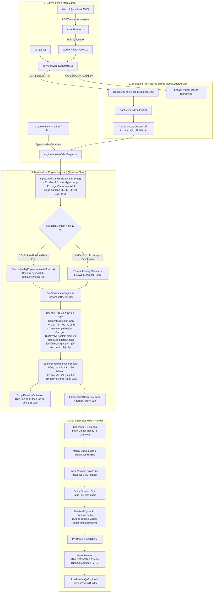

# QUY TRÌNH HIỆN TẠI (CURRENT FLOW)
**Dự án:** AI Text-to-Video Engine  
**Mục tiêu:** Mô tả chi tiết từng bước luồng thực thi hiện tại và chỉ ra các điểm gãy kiến trúc.

---

## 1. Sơ Đồ Luồng Hiện Tại (Architecture Flowchart)

---

## 2. Chi Tiết Từng Bước & Những Điểm Gãy (Pain Points)

### Bước 1: Tiếp nhận yêu cầu & Phân mảnh luồng
- **Web App & CLI** đi qua `videoGenerator.ts`.
- **Benchmark / Unit Tests** gọi thẳng `MasterVideoEngine.execute()`.
- **Hậu quả:** Môi trường test không kiểm tra chính xác đường đi mà người dùng thật đang trải nghiệm.

### Bước 2: Dị thường "Nghiên cứu 2 lần" (Double Research Anomaly)
- `videoGenerator.ts` tự chạy `ResearchEngine` tìm kiếm Wikipedia/Bing, trích xuất sự thật và ghép thành một chuỗi văn bản dài `extractedContext`.
- Khi truyền vào `MasterVideoEngine`, engine này kiểm tra thấy `extractedContext` có sẵn nên **bỏ qua hoàn toàn** tầng `ResearchQueryPlanner` và `LiveWebSearcher` hiện đại của nó.
- Kết quả là logic tìm kiếm thông minh bị vô hiệu hóa khi người dùng tạo video từ giao diện Web!

### Bước 3: Đổi hướng ý định người dùng (User Intent Distortion)
- `InputUnderstandingEngine` dùng regex quét từ khóa trong prompt để ép vào 19 thể loại.
- Bất kể người dùng muốn làm video cho YouTube, Facebook hay mục đích nội bộ, hệ thống đều tự gán `targetPlatform: 'tiktok'`.
- Thời lượng người dùng yêu cầu (ví dụ: 40 giây) bị tự tiện quy đổi thành 45 giây hoặc 30 giây.

### Bước 4: Áp đặt sáng tạo giật gân (Creative Dominance)
- `ContentStrategist` tự bịa ra "nỗi đau người xem" (`viewerProblem`) bằng văn mẫu.
- `HookCandidateEngine` bắt buộc phải có câu hook giật gân kiểu giật tít mạng xã hội, phá vỡ tính trang nghiêm hoặc tự nhiên của các chủ đề khoa học, giáo dục, tài liệu.
- `SeniorScriptWriter` tự chèn các câu dẫn dắt chung chung, câu kết thúc triết lý sáo rỗng và tự động chèn CTA dù người dùng không hề yêu cầu.

### Bước 5: Thiếu vòng lặp điều chỉnh kịch bản theo giọng đọc thật (No Audio Duration Loop)
- Hệ thống chỉ ước tính độ dài bằng số từ chia cho 2.65 từ/giây.
- Sau khi TTS đọc xong, nếu file audio thực tế dài hơn hoặc ngắn hơn nhiều so với thời lượng mong muốn, hệ thống **không** có cơ chế viết lại hoặc cắt tỉa kịch bản. Nó chỉ đơn giản kéo dãn timeline hoặc để audio quyết định, dẫn đến việc không tuân thủ cam kết thời lượng với người dùng.

### Bước 6: Storyboard tự ý chèn quảng cáo và bố cục
- Renderer trong `template.ts` có logic tự chèn banner giỏ hàng TikTok Shop nếu phát hiện cờ deal, làm phân tán sự chú ý của người xem.
