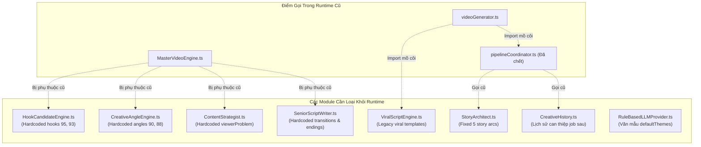

# KẾ HOẠCH DI TRÚ & ĐỒ THỊ PHỤ THUỘC (MIGRATION PLAN & DEPENDENCY GRAPH)
**Dự án:** Universal Multi-Domain Video Engine  
**Nguyên tắc triển khai:** REMOVE FROM RUNTIME → REPLACE → VERIFY → DELETE

---

## A. Đồ Thị Phụ Thuộc Của Các Module Cần Loại Khỏi Runtime

Dưới đây là đồ thị các module cũ cần ngắt khỏi luồng thực thi chính (Canonical Runtime):



### Các bước ngắt phụ thuộc (Decoupling Steps):
1. **Trong `MasterVideoEngine.ts`:**
   - Thay thế `InputUnderstandingEngine` bằng `UniversalIntentEngine`.
   - Ngắt kết nối `ContentStrategist`, `CreativeAngleEngine`, `HookCandidateEngine`. Thay bằng `AdaptiveContentPlanner`.
   - Ngắt kết nối `SeniorScriptWriter`. Thay bằng `UniversalScriptWriter`.
2. **Trong `videoGenerator.ts`:**
   - Xóa bỏ tiền xử lý `ResearchEngine` thừa thãi (dòng 166-208).
   - Chuyển hướng trực tiếp sang `CanonicalVideoEngine.execute()`.
3. **Trong `CreativeHistory.ts`:**
   - Vô hiệu hóa hàm `getAvoidanceAdvice()`. Không để lịch sử can thiệp vào job mới.
4. **Trong `LLMFactory.ts` & `RuleBasedLLM.ts`:**
   - Gỡ bỏ `defaultThemes` văn mẫu giật gân.

---

## B. Xác Định Entry Point Duy Nhất (Canonical Single Entry Point)

Mọi entry point (`videoRoutes.ts`, `videoWorker.ts`, `cli.ts`, `execute_benchmark.ts`, tests) sẽ quy về một hàm thực thi chuẩn:

```
CanonicalVideoEngine.execute(request: CanonicalVideoRequest, onProgress?: ProgressCallback)
```
Nằm tại: `src/engine/canonicalVideoEngine.ts` (hoặc refactor chính `MasterVideoEngine.ts` thành Canonical Engine).

### Cấu trúc `CanonicalVideoRequest`:
```ts
export interface CanonicalVideoRequest {
  jobId?: string;
  operation: 'CREATE_NEW' | 'REVISE_EXISTING';
  prompt: string;
  url?: string;
  duration?: number;           // requestedSeconds (immutable)
  aspectRatio?: '9:16' | '16:9' | '1:1';
  outputFile?: string;
  outputDir?: string;
  tempDir?: string;
  ttsVoice?: string;
  visualStyle?: string;
  fontFamily?: string;
  isAffiliate?: boolean;
  productData?: any;
  revision?: {
    baseVersion: any;
    revisionScope?: string;
    feedback: string;
  };
}
```

---

## C. Kế Hoạch Di Trú Không Làm Gãy Web UI & CLI (Non-Breaking Migration)

Để bảo đảm giao diện Web (`localhost:3000`) và lệnh CLI (`npm run video`) hoạt động trơn tru không gián đoạn:

1. **Giữ nguyên hợp đồng giao tiếp của `generateVideo()`:**
   - Hàm `generateVideo(options, onProgress)` trong `src/services/videoGenerator.ts` vẫn nhận đầy đủ các tham số cũ (`GenerateVideoOptions`) và trả về `GenerateVideoResult`.
   - Bên trong, `generateVideo()` sẽ ánh xạ `GenerateVideoOptions` sang `CanonicalVideoRequest` và ủy quyền 100% cho `CanonicalVideoEngine.execute()`.
2. **Bảo toàn Database & Queue Schema:**
   - Bảng `videos`, `video_versions`, và cấu trúc payload của BullMQ `VideoJobPayload` được giữ nguyên vẹn.
3. **Bảo toàn Web Frontend API:**
   - Form tạo video và kết quả video không cần thay đổi payload, nhưng video xuất xưởng sẽ phản ánh đúng ý định, không còn văn mẫu.

---

## D. Checkpoint Lưu Trữ (Backup Checkpoint)

- **Vị trí Checkpoint:** Thư mục `checkpoint_pre_universal_refactor/src/`.
- **Trạng thái:** Đã sao lưu toàn bộ mã nguồn `src/` thành công lúc 12:35 PM ngày 30/09/2026.
