# QUY TRÌNH MỤC TIÊU TINH GỌN (SIMPLIFIED TARGET FLOW)
**Dự án:** AI Text-to-Video Engine — User-Intent-First Adaptive Architecture  
**Nguyên tắc tối thượng:** Hiểu đúng yêu cầu người dùng -> Giữ đúng chủ đề -> Đúng dữ kiện -> Đúng thời lượng -> Nội dung đáng xem -> Hình ảnh trung thực -> Voice/Timeline chuẩn xác -> Motion tinh tế.

---

## 1. Sơ Đồ Quy Trình Mục Tiêu Thống Nhất (Single Canonical Flow)

```mermaid
flowchart TD
    subgraph UnifiedEntry["1. Unified Entry Point (Tất cả gọi chung 1 Engine Duy Nhất)"]
        WebUI["Web UI"] --> API["POST /api/videos/create"]
        CLI["CLI (cli.ts)"] --> CanonicalAPI["CanonicalVideoEngine.generate()"]
        Tests["Benchmark / Tests"] --> CanonicalAPI
        API --> CanonicalAPI
    end

    subgraph Phase1["2. Intent Understanding & Topic Contract"]
        CanonicalAPI --> IntentEngine["IntentUnderstandingEngine.resolve()"]
        IntentEngine --> Spec["UserIntentSpec (Single Source of Truth)<br/>- requestId, originalUserRequest, primaryGoal, primaryTopic<br/>- requiredEntities, optionalEntities, excludedScope<br/>- targetDurationSeconds, userConstraints, language, tone"]
        
        Spec --> ConfidenceGate{"Intent Confidence Gate<br/>- Đã hiểu rõ mục tiêu?<br/>- Đã có duration?<br/>- Có tự thêm mục tiêu không?"}
        ConfidenceGate -->|Không đủ tin cậy| Clarify["NEEDS_CLARIFICATION<br/>(Dừng lại, không đoán mò)"]
        ConfidenceGate -->|Đạt chuẩn| Contract["TopicContract<br/>- coreTopic, coreQuestion, requiredCoverage<br/>- allowedExpansion, prohibitedExpansion<br/>- requiredEntities, relevanceCriteria"]
        Spec --> DurContract["DurationContract<br/>- requestedSeconds (Bất biến)<br/>- minimumAcceptedSeconds, maximumAcceptedSeconds"]
    end

    subgraph Phase2["3. Adaptive Research & Knowledge Compression"]
        Contract --> ResPlanner["AdaptiveResearchPlanner.plan()<br/>- Chỉ research điều cần thiết<br/>- Xác định entities cần verify<br/>- Đặt Stop Conditions"]
        ResPlanner --> Discovery["Search & Source Discovery (Bing/Google/Wikipedia)"]
        Discovery --> Clean["CleanContentExtractor: Lọc bỏ rác web (nav, ads, cookie)"]
        Clean --> Verify["FactVerificationEngine: VerifiedFact[] (Phải có Evidence & Provenance)"]
        Verify --> Compress["KnowledgeBriefBuilder (Nén tri thức)<br/>- coreUnderstanding, strongestFacts, meaningfulNumbers<br/>- LOẠI BỎ hoàn toàn metadata và rác web"]
    end

    subgraph Phase3["4. Content Planning & Scriptwriting"]
        Compress & Contract & Spec --> ContentPlan["ContentPlanner (Quyết định thích ứng)<br/>- Mạch logic phù hợp duration<br/>- Có cần hook giật gân không hay mở đầu trực diện?<br/>- Có cần CTA không? (Chỉ thêm nếu user muốn)<br/>- Độ sâu và số lượng beat phù hợp"]
        
        ContentPlan --> Writer["AdaptiveScriptWriter.write()<br/>- Chỉ nhận: Spec + Contract + KnowledgeBrief + ContentPlan<br/>- Không nhận raw HTML/Snippets<br/>- Viết văn tự nhiên, không filler, không văn mẫu"]
        
        Writer --> ValueCheck["Content Value Check & Topic Fidelity Check<br/>- Từng câu phải phục vụ TopicContract (CORE / SUPPORTING)<br/>- Loại bỏ câu OFF_TOPIC"]
        
        ValueCheck --> Reviewer["IndependentScriptReviewer<br/>- Độc lập với Writer<br/>- Trích dẫn chính xác lỗi (nếu có)<br/>- Đạt chuẩn -> ApprovedScript"]
    end

    subgraph Phase4["5. Voice-Driven Duration Reconciliation Loop"]
        Reviewer --> TTS["TTS Generation (VoiceDirector)<br/>Đo thời lượng phát âm thực tế (actualAudioSeconds)"]
        TTS --> DurCheck{"So khớp DurationContract?<br/>(actual vs requestedSeconds)"}
        DurCheck -->|Quá dài: Audio > maxAccepted| Shorten["Rút gọn / Viết lại script (Content Layer)"]
        DurCheck -->|Quá ngắn: Audio < minAccepted| Expand["Bổ sung fact có giá trị từ KnowledgeBrief"]
        Shorten & Expand --> Rewriter["Tái sinh kịch bản tinh chỉnh"]
        Rewriter --> TTS
        DurCheck -->|Khớp chuẩn xác| Timeline["Voice is Timeline Source of Truth<br/>Khóa cứng toàn bộ Scene Timestamps theo Audio Thật"]
    end

    subgraph Phase5["6. Storyboard, Asset Verification & Render"]
        Timeline --> Storyboard["StoryboardPlanner (Tuân thủ 100% ApprovedScript)<br/>Không tự ý thêm claim/entity/deal mới"]
        Storyboard --> VisualIntent["VisualIntentEngine: Xác định mục đích visual từng beat"]
        VisualIntent --> AssetEngine["EntityAssetEngine & AssetVerifier<br/>- Ưu tiên ảnh thật xác thực cho Real Entity<br/>- Fallback trung tính (chart/map/kinetic text) nếu thiếu<br/>- Không dùng ảnh AI giả mạo làm ảnh thực tế"]
        AssetEngine --> Manifest["RenderManifest (Chứa toàn bộ Verified Assets & Compositions)"]
        Manifest --> PreGate["PreRenderQualityGate (Kiểm tra an toàn cuối cùng)"]
        PreGate --> Renderer["HyperFrames Renderer (HTML/CSS/GSAP -> MP4)"]
        Renderer --> PostQA["Final Output QA (Kỹ thuật + Nội dung + Hình ảnh + Audio)"]
    end
```



---

## 2. Danh Sách 10 Đối Tượng Dữ Liệu Cốt Lõi (10 Core Contracts)

Để tối giản kiến trúc và loại bỏ hàng chục file nhỏ lẻ không cần thiết, toàn bộ hệ thống sẽ xoay quanh **10 Contracts chuẩn**:

1. **`UserIntentSpec` (Single Source of Truth):**
   ```ts
   interface UserIntentSpec {
     requestId: string;
     originalUserRequest: string;
     primaryGoal: string;
     primaryTopic: string;
     requiredEntities: string[];
     optionalEntities: string[];
     excludedScope: string[];
     targetAudience: string;
     targetPlatform: string;
     targetDurationSeconds: number;
     language: string;
     desiredTone: string;
     desiredStyle: string;
     factualityLevel: 'STRICT' | 'BALANCED' | 'CREATIVE';
     freshnessRequirement: 'LATEST' | 'RECENT' | 'EVERGREEN';
     userConstraints: string[];
     outputRequirements: string[];
     assumptions: string[];
     ambiguities: string[];
   }
   ```

2. **`TopicContract` (Ranh giới nội dung bất biến):**
   ```ts
   interface TopicContract {
     coreTopic: string;
     coreQuestion: string;
     requiredCoverage: string[];
     allowedExpansion: string[];
     prohibitedExpansion: string[];
     requiredEntities: string[];
     relevanceCriteria: string;
   }
   ```

3. **`DurationContract` (Cam kết thời lượng bắt buộc):**
   ```ts
   interface DurationContract {
     requestedSeconds: number;
     minimumAcceptedSeconds: number; // e.g. requested - 2s
     maximumAcceptedSeconds: number; // e.g. requested + 2s
   }
   ```

4. **`ResearchPlan` (Kế hoạch tìm kiếm thích ứng):**
   ```ts
   interface ResearchPlan {
     researchObjectives: string[];
     researchQuestions: string[];
     entitiesToVerify: string[];
     freshnessNeeds: string;
     sourcePriorities: string[];
     stopConditions: string[];
   }
   ```

5. **`VerifiedFact[]` (Sự thật có bằng chứng & nguồn gốc):**
   ```ts
   interface VerifiedFact {
     id: string;
     claim: string;
     evidence: string;
     source: string;
     sourceType: 'OFFICIAL' | 'NEWS' | 'WIKIPEDIA' | 'USER_URL';
     confidence: number;
     freshness: string;
     relevance: number;
     entities: string[];
   }
   ```

6. **`KnowledgeBrief` (Tri thức chắt lọc, không rác web):**
   ```ts
   interface KnowledgeBrief {
     coreUnderstanding: string;
     strongestFacts: VerifiedFact[];
     supportingFacts: VerifiedFact[];
     meaningfulNumbers: string[];
     relevantEntities: string[];
     nuances: string[];
     unansweredQuestions: string[];
     visualOpportunities: string[];
     informationToAvoid: string[];
   }
   ```

7. **`ContentPlan` (Bản thiết kế nội dung thích ứng):**
   ```ts
   interface ContentPlan {
     narrativeApproach: 'DIRECT_EXPLANATION' | 'STORY' | 'COMPARISON' | 'DATA_DRIVEN' | 'JOURNEY';
     openingStrategy: 'DIRECT_STATEMENT' | 'QUESTION' | 'KEY_STATISTIC';
     needHook: boolean;
     needCta: boolean;
     ctaMessage?: string;
     targetBeatCount: number;
     beatsOutline: Array<{
       beatIndex: number;
       purpose: string;
       keyInformation: string;
       targetSeconds: number;
     }>;
   }
   ```

8. **`ApprovedScript` (Kịch bản hoàn thiện đã qua kiểm duyệt):**
   ```ts
   interface ApprovedScript {
     title: string;
     totalWords: number;
     estimatedDurationSec: number;
     beats: Array<{
       beatId: number;
       purpose: string;
       narration: string;
       displayHeadline: string;
       supportingText?: string;
       metricBadge?: string;
       expectedEntities: string[];
       targetDurationSec: number;
       factIds: string[];
     }>;
     fidelityScore: number;
     reviewPassed: boolean;
   }
   ```

9. **`RenderManifest` (Kế hoạch sản xuất & Asset đã xác minh):**
   ```ts
   interface RenderManifest {
     jobId: string;
     inputHash: string;
     duration: number;
     audioMasterPath: string;
     audioTimestamps: Array<{ sceneId: number; startTime: number; duration: number }>;
     verifiedAssets: Array<{
       sceneId: number;
       filePath: string;
       visualType: string;
       isRealAsset: boolean;
     }>;
     scenes: Array<{
       id: number;
       startTime: number;
       duration: number;
       headline: string;
       voiceOver: string;
       metric?: string;
       tag?: string;
     }>;
   }
   ```

10. **`FinalQAReport` (Báo cáo chất lượng trước khi bàn giao):**
    ```ts
    interface FinalQAReport {
      technicalPassed: boolean;
      contentFidelityPassed: boolean;
      visualAuthenticityPassed: boolean;
      audioIntegrityPassed: boolean;
      durationDifferenceSec: number;
      verdict: 'PASS' | 'FAIL';
    }
    ```

---

## 3. Lợi Ích Của Kiến Trúc Tinh Gọn Này

1. **Một Engine duy nhất:** Xóa bỏ hoàn toàn tình trạng Web chạy một kiểu, CLI chạy một kiểu, Benchmark chạy kiểu khác.
2. **Không còn văn mẫu:** Loại bỏ các câu thoại triết lý sáo rỗng và các câu hook kích động không cần thiết.
3. **Giải quyết thời lượng bằng nội dung:** Vòng lặp Audio-Driven Duration Loop điều chỉnh chính xác số từ/nội dung theo giọng đọc thật, không còn hiện tượng clip bị cắt tiếng hoặc hình đứng im chờ tiếng.
4. **Cô lập tuyệt đối:** Mỗi job là một không gian sạch sẽ, không có bất kỳ trạng thái chia sẻ nào từ quá khứ can thiệp vào.
